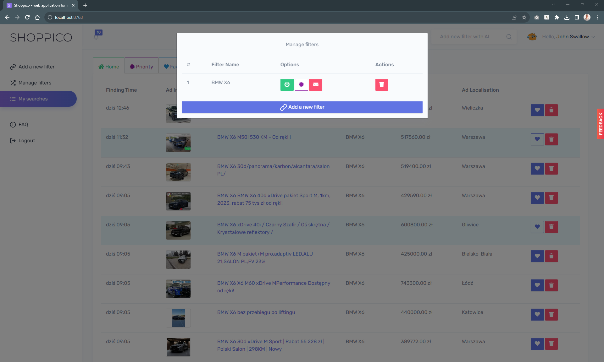

# Shoppico ⚡
web application for aggregating advertisements found on the Internet using any parser.

Are you looking for an apartment on advertising portals?
If you are looking for a new or used car or other thing that can be found on advertising portals, this application is for you.

## Minimum requirements
* HTTP server. For example: Apache. It is preferred to have mod_rewrite, but by no means required. If you prefer, you can also use nginx or Microsoft IIS.
* Minimum PHP 8.2.
* mbstring PHP extension
* intl PHP extension
* SimpleXML PHP extension
* PDO PHP extension

> **IMPORTANT**
In XAMPP, the intl extension is included, but you need to uncomment extension=`php_intl.dll` (or extension=`intl`) in **php.ini** and restart the server via the XAMPP Control Panel.
In WAMP, the intl extension is "activated" by default, but it does not work. For this to work you need to go to the php folder (default) **C:\wamp\bin\php\php{version}**, copy all files that look like `icu*.dll` and paste them into the Apache bin directory **C:\wamp\bin\apache\apache{version}\bin**. 
Then restart all services and it should be OK.

## Database
* MySQL (5.6 or higher)

> **IMPORTANT**
All built-in drivers require PDO. You should make sure you have the appropriate PDO extensions installed.

## Installation and Usage
See **[Documentation](_docs/README.md)**.

## Preview

